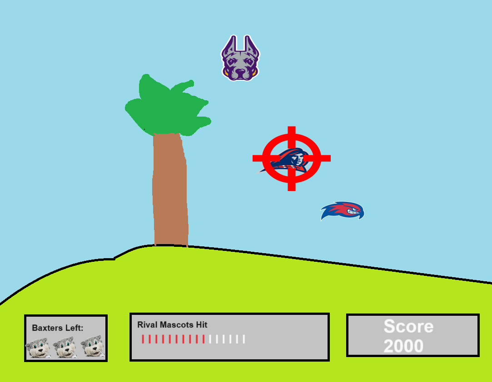

:warning: Everything between << >> needs to be replaced (remove << >> after replacing)

# AEC Duck Hunt
## CS110 Final Project  Fall Semester, 2023

## Team Members

Michael Icarangal, Markus Massina

***

## Project Description

We plan to build a duck hunting game where you can use a gun with limited ammo to hunt ducks and get points. Our twist on this will be that 
the ducks will be rival school mascots 

***    

## GUI Design

### Initial Design

### Final Design

## Program Design

### Features

1. Total Points 
2. Total Shots 
3. Clock 
4. End screen showing ducks hit/accuracy
5. Different mascots moving in Different Patterns

### Classes

mascot class: This represents a mascot in the Duck Hunt game. It handles the mascot's movement, animation, and response to being shot.

clock class: This represents the in-game clock used to track the remaining time for the Duck Hunt game. It provides methods to start the clock, update the countdown, and manage the visual representation of the timer.

cursor class: This class represents the cursor used in the Duck Hunt game. It is responsible for tracking the mouse position, detecting mouse clicks, and playing gunshot sounds. The cursor sprite is updated to follow the mouse movements.

game class: This class represents the in-game clock used to track the remaining time for the Duck Hunt game. It provides methods to start the clock, update the countdown, and manage the visual representation of the timer.

## ATP
1. Test Case: User Interface
- Test Description: Verify the functionality and appearance of the user interface elements.
- Test Steps:
1.1 Launch the game.
1.2 Pause game by pressing P
1.3 Exit game.
- Expected Outcome: The user interface is intuitive, buttons respond to clicks, and the game starts without errors.

2. Test Case: Duck Spawning
- Test Description: Ensure mascots spawn correctly and follow patterns.
- Test Steps:
2.1 Start a new game.
2.2 Observe the spawning of mascots.
2.3 Confirm mascots move in patterns.
- Expected Outcome: Mascots spawn appropriately and move realistically.

3. Test Case: Shooting Mechanism
- Test Description: Validate the shooting mechanism and accuracy.
- Test Steps:
3.1 Start a new game.
3.2 Aim at a mascot.
3.3 Fire a shot.
- Expected Outcome: Shots accurately hit the targeted mascots, and the shooting mechanism responds appropriately.

4. Test Case: Scoring System
- Test Description: Confirm the scoring system calculates points accurately.
- Test Steps:
4.1 Start a new game.
4.2 Successfully shoot mascots.
4.3 Miss shots intentionally.
- Expected Outcome: Points are assigned correctly for successful shots, and no points are awarded for missed shots.

5. Test Case: Game Over 
- Test Description: Ensure the game ends appropriately under different scenarios.
- Test Steps:
5.1 Start a new game
5.2 Play game until timer runs out
- Expected Outcome: The game ends when the timer runs out or the player reaches the target score, displaying text showing that game is over with 
accuracy/ducks shot shown

