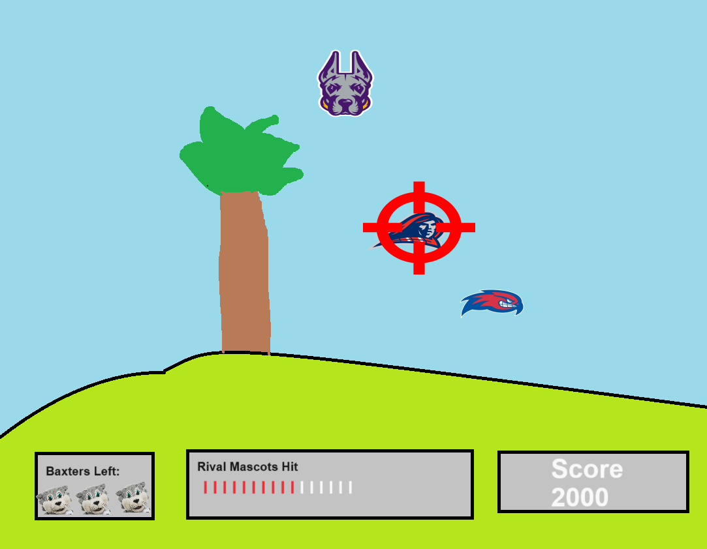
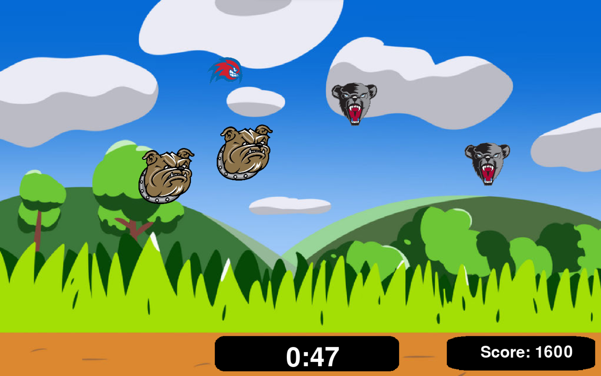
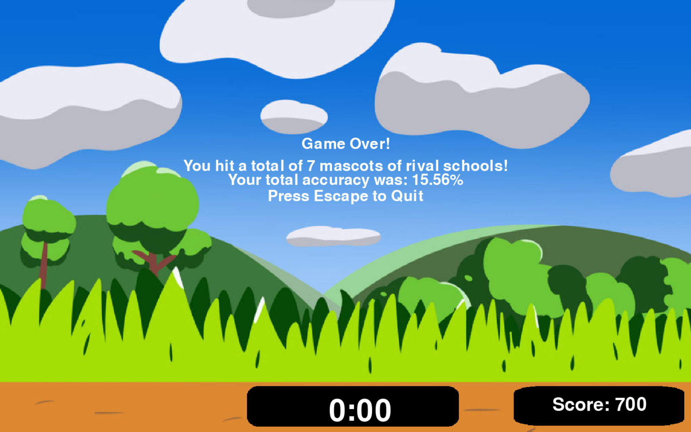

:warning: Everything between << >> needs to be replaced (remove << >> after replacing)

# AEC Duck Hunt
## CS110 Final Project  Fall Semester, 2023

## Team Members

Michael Icarangal, Markus Massina

***

## Project Description
A version of the classic game Duck Hunt where all the ducks are replaced by Binghamton University's rivals in the AEC! The player will have a chance to eliminate these mascots by clicking on the with the mouse over an interval of one minute! Total mascots hit and accuracy are shown in the game over screen. 

***    

## GUI Design
### Initial Design

### Final Design

## Program Design

### Features

1. Total Points 
2. Pause 
3. Timer
4. End screen showing mascots hit/accuracy
5. Different mascots moving in different patterns
6. Data permanence by keeping scores in highscores.txt

### Classes

mascot class: image, height and width, speed, direction count to move sprite up/down, direction, starting x/y coords, boolean of if sprite is moving straight
- init: chooses an image to load for the sprite and creates sprite  
- move_up: moves sprite up based on increment
- move_down: moves sprite down based on increment
- move_left: moves sprite left based on increment
- move_right: moves sprite right based on increment
- change_direction: if moving right, sprite will move left and if moving left the sprite will move right. Will occasionally move sprite up/down
- update: combines movement and change direction method to move sprite randomly

background class: screen, image, height and width of screen, left and top coordinate of image
- init: loads background image and creates background for game

## ATP
1. Test Case: Pause
- Test Description: Verify the functionality and appearance of the user interface elements.  
- Test Steps:  
1.1 Launch the game.  
1.2 Pause game by pressing P  
1.3 Unpause by pressing P again  
- Expected Outcome: The game pauses, showing a white screen and the word "paused" and when pressing P again the game resumes

2. Test Case: Mascot Spawning
- Test Description: Ensure mascots spawn correctly and follow patterns.  
- Test Steps:  
2.1 Start a new game.  
2.2 Observe the spawning of mascots.  
2.3 Confirm mascots move in patterns.  
- Expected Outcome: Mascots spawn appropriately and move

3. Test Case: Shooting Mechanism 
- Test Description: Validate the shooting mechanism and accuracy.
- Test Steps: 
3.1 Start a new game. 
3.2 Aim at a mascot.  
3.3 Fire a shot. 
- Expected Outcome: Shots accurately hit the targeted mascots, and the shooting mechanism responds appropriately.

4. Test Case: Scoring System
- Test Description: Confirm the scoring system calculates points accurately.  
- Test Steps:  
4.1 Start a new game.  
4.2 Successfully shoot mascots.  
4.3 Miss shots intentionally.  
- Expected Outcome: Points are assigned correctly for successful shots, and no points are awarded for missed shots.

5. Test Case: Game Over 
- Test Description: Ensure the game ends appropriately under different scenarios.  
- Test Steps:  
5.1 Start a new game  
5.2 Play game until timer runs out  
- Expected Outcome: The game ends when the timer runs out or the player reaches the target score, displaying text showing that game is over with 
accuracy/mascots hit

